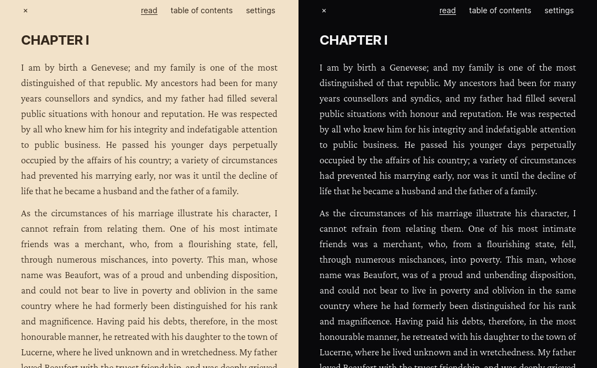

# wepu

https://lessflake.github.io/wepu/

Basic web-based (Wasm) EPUB reader. Fully client-side.

Click middle area and select EPUB to upload. Many public domain novels are available in EPUB format online through websites such as [Project Gutenberg](https://www.gutenberg.org/).

Only supports a subset of the EPUB specification, aimed at viewing standard novels as opposed to documents with greater layout complexity.
